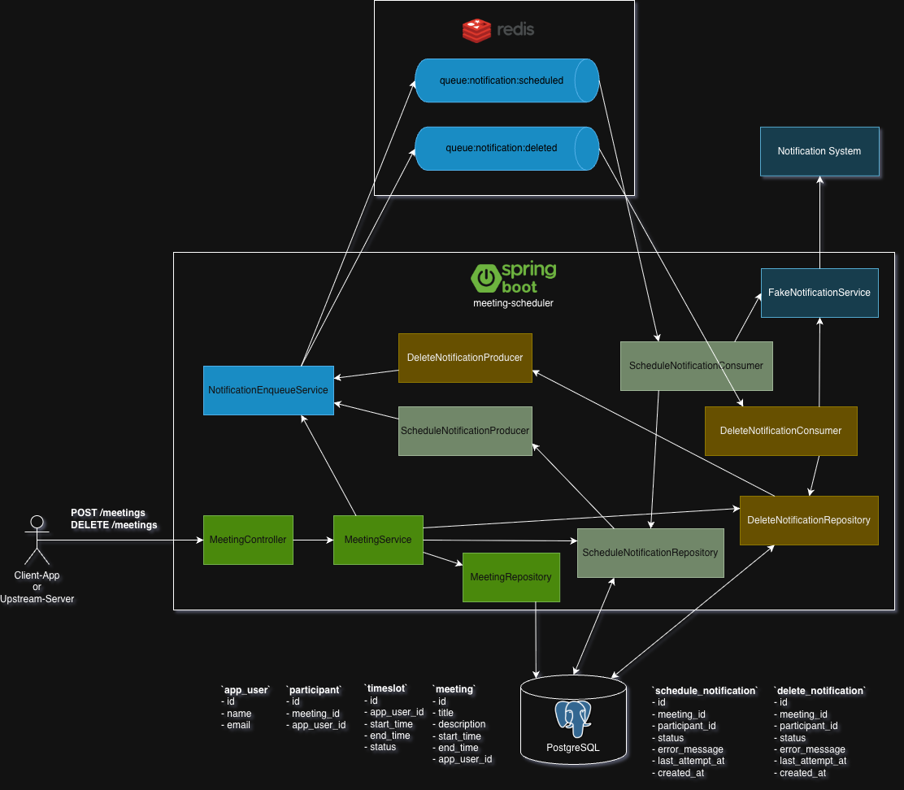

# Meeting Scheduler

A REST API for scheduling meetings against user availability - a mini Doodle.
Users manage their personal calendar by publishing free timeslots; booking a meeting automatically carves out the exact time from every participant's calendar and restores it on deletion.

## Quick Start

**Prerequisites:** Java 21, Maven, Docker (runs Postgres + Redis).

```bash
./run.sh
```

`run.sh` starts the Postgres container via Docker Compose, waits until the database is ready, builds the JAR, and launches the application. Flyway applies all migrations automatically on startup. The application listens on `http://localhost:8080`.

When you terminate the process (Ctrl+C), Spring Boot shuts down gracefully and the Postgres container is stopped, but the Docker volume is preserved so data persists across restarts.

To fully wipe the database:

```bash
docker compose down --volumes
```

**Run the tests:**

```bash
./mvnw clean test
```

## How to Consume the API

Interactive documentation is available at **http://localhost:8080/swagger-ui.html** once the app is running.
The OpenAPI spec is at `http://localhost:8080/v3/api-docs`.
A Postman collection covering the full happy path (create users, publish timeslots, schedule and delete a meeting) is included at `meeting-scheduler.postman_collection.json`.

Typical usage flow:

1. **Register users** - `POST /users`
2. **Publish availability** - `POST /users/{userId}/timeslots?startTime=...&endTime=...`
3. **Query a user's calendar** - `GET /users/{userId}/timeslots` (optionally filter by `status=FREE|BOOKED`, `from`, `to`)
4. **Schedule a meeting** - `POST /users/{userId}/meetings` with participants and time range (userId is the organizer)
5. **Query a user's meetings** - `GET /users/{userId}/meetings` (returns meetings where the user is organizer or participant)
6. **Delete a meeting** - `DELETE /users/{userId}/meetings/{id}`

## Architecture

The diagram below shows the transactional outbox pattern used for at-least-once notification delivery.



The project follows a standard layered architecture inside a single Spring Boot application.

```
meeting-scheduler/
├── user/           # User registration and lookup
├── timeslot/       # Calendar management (CRUD + overlap/merge logic)
├── meeting/        # Meeting scheduling, deletion, and listing
├── participant/    # Join entity linking meetings to attendees
├── notification/   # Async event notifications (entities, producers, consumers, Feign client)
├── redis/          # RedisTemplate configuration and queue key constants
├── exception/      # Domain exception types + GlobalExceptionHandler
└── util/           # Shared utilities (time validation)
```

Each domain package contains:

| Layer | Role |
|---|---|
| `*Controller` | HTTP entry point, validates input, delegates to service |
| `*Service` | Business logic and transaction boundary |
| `*Repository` | Spring Data JPA, derived queries only, no string SQL |
| `*Entity` | JPA-managed table |
| `*Mapper` | MapStruct, entity to DTO conversion |
| `dto/` | Request and response records with Bean Validation constraints |

`exception/GlobalExceptionHandler` (`@RestControllerAdvice`) centralizes all error responses.
Services throw typed domain exceptions (`NotFoundException`, `ConflictException`, `ForbiddenException`, `BadRequestException`, `UnprocessableEntityException`) with no HTTP dependency; the handler maps each type to its status code and serializes a uniform `{"status": …, "message": …}` body.

**Tech stack:** Java 21 · Spring Boot 4 · Spring Data JPA · PostgreSQL · Flyway · Redis · Spring Data Redis · OpenFeign · Resilience4j · MapStruct · Lombok · springdoc-openapi

**Database schema:**

```
app_user ──< timeslot
app_user ──< meeting ──< participant >── app_user
meeting  ──< schedule_notification >── app_user
         ──< delete_notification   >── app_user
```

## Design Decisions

### Calendar as a collection of timeslots

The challenge calls for each user to have a personal calendar. Rather than introducing a separate `calendar` table (which would be a one-to-one with `app_user` and add a join with no behavioural benefit), the user's calendar **is** their collection of timeslots. The `timeslot` table is always queried scoped to a `user_id`, so the calendar view is simply `GET /users/{userId}/timeslots?from=...&to=...&status=FREE|BOOKED`. This keeps the model flat and queries straightforward.

### Timeslot auto-merge on creation

When a new timeslot is adjacent to or overlaps existing FREE slots for the same user, they are automatically merged into one. This keeps the calendar contiguous and makes availability queries simpler: a single row represents a block of free time rather than a fragmented list of adjacent slots.

### Slot splitting on meeting booking

When a meeting is booked, each party's covering FREE slot is split into up to three pieces: a FREE left remainder, a BOOKED slot for the exact meeting range, and a FREE right remainder. This preserves the user's partial availability around the meeting: the calendar stays accurate without any manual intervention.

### Async at-least-once notification delivery

When a meeting is created or deleted, a `PENDING` notification row is written to the database **in the same transaction** as the business operation. This ensures the intent to notify is never lost even if the application crashes immediately after. After the transaction commits, the service makes a best-effort enqueue into a Redis sorted set so consumers can process the notification immediately.

Scheduled producers run every 10 seconds and re-enqueue any rows that are still `PENDING`, acting as a recovery mechanism for Redis outages or missed fast-path enqueues. Consumers process each notification concurrently via a thread pool, mark it `COMPLETED` on success, or `FAILED` (with the error message) if the Feign call fails after retries. Resilience4j retries the Feign call up to three times with exponential backoff before giving up.

This pattern (write intent to DB first, enqueue second, producer as safety net) guarantees at-least-once delivery without a distributed transaction or an outbox framework.

### Slot restoration and re-merge on meeting deletion

Deleting a meeting restores each BOOKED slot back to FREE and triggers the same merge logic used on creation. This means the calendar is returned to exactly the contiguous state it was in before the meeting was booked.

### Concurrency design

Two layers protect against concurrent booking of the same slot:

1. **Pessimistic write lock** (`SELECT FOR UPDATE`) on the user row at timeslot creation time, serializing all slot writes for a given user so overlap checks are race-free.
2. **UNIQUE constraints** on `(owner_id, start_time, end_time)` in `timeslot` and `(organizer_id, start_time, end_time)` in `meeting` as a final safety net for requests that pass the application-level check simultaneously.

### Performance at scale

The schema is designed for hundreds of users with thousands of slots:

- Indexes on `timeslot(owner_id, start_time, end_time)` and `timeslot(owner_id, status)` keep availability queries fast regardless of total row count.
- All availability queries are scoped to a single `owner_id`: no full-table scans.
- HikariCP manages the connection pool; Tomcat handles request concurrency.

## Core Features

### Timeslot Management

Users publish availability as timeslots with a `FREE` or `BOOKED` status. Adjacent or overlapping FREE slots are automatically merged on creation.

**Merge example:**

| Action | Before | After |
|---|---|---|
| Create `10:00-11:00` | (none) | `10:00-11:00 FREE` |
| Create `11:00-12:00` | `10:00-11:00 FREE` | `10:00-12:00 FREE` (merged) |
| Create `09:00-10:30` | `10:00-12:00 FREE` | `09:00-12:00 FREE` (merged) |

### Calendar Availability Query

`GET /users/{userId}/timeslots` returns the user's calendar. All filters are optional:

| Parameter | Description |
|---|---|
| `status` | `FREE` or `BOOKED`: omit to return all slots |
| `from` | Only slots starting at or after this datetime |
| `to` | Only slots ending at or before this datetime |

Results are sorted by `startTime` then `endTime` ascending.

### Meeting Scheduling

A meeting is booked by specifying the organizer, participants, and the desired time range. Every party must have a FREE slot fully covering the range: the organizer and each participant. If anyone has no covering slot the request is rejected with `422 Unprocessable Entity`. When all slots are confirmed, each is split to reflect the booked time.

**Split cases:**

**1. Exact fit:** meeting fills the slot exactly

```
Before:  [10:00 ──────── 11:00] FREE
Meeting:  10:00 ──────── 11:00
After:   [10:00 ──────── 11:00] BOOKED
```

**2. Right remainder:** meeting starts at slot start but ends before slot end

```
Before:  [10:00 ──────────────── 12:00] FREE
Meeting:  10:00 ──────── 11:00
After:   [10:00 ──────── 11:00] BOOKED  +  [11:00 ──── 12:00] FREE
```

**3. Left remainder:** meeting starts after slot start but ends at slot end

```
Before:  [09:00 ──────────────── 11:00] FREE
Meeting:          10:00 ──────── 11:00
After:   [09:00 ── 10:00] FREE  +  [10:00 ──────── 11:00] BOOKED
```

**4. Both remainders:** meeting occupies the middle of the slot

```
Before:  [09:00 ──────────────────────── 12:00] FREE
Meeting:          10:00 ──────── 11:00
After:   [09:00 ── 10:00] FREE  +  [10:00 ──────── 11:00] BOOKED  +  [11:00 ──── 12:00] FREE
```

### Meeting Deletion

`DELETE /users/{userId}/meetings/{id}` restores every party's BOOKED slot back to FREE and re-merges any adjacent FREE slots, leaving each calendar in exactly the contiguous state it was in before the meeting was booked. Only the organizer may delete a meeting; a participant attempting to delete receives `403 Forbidden`.

> **Deletion vs. cancellation:** this demo implements deletion only - the organizer removes the entire meeting and all slots are restored. A cancellation feature (where a single participant opts out without affecting the rest of the meeting) is out of scope.

### Conflict and Validation Rules

| Scenario | Response |
|---|---|
| Timeslot with the same owner, start, and end already exists | `409 Conflict` |
| New timeslot is fully contained within an existing timeslot | `409 Conflict` |
| New timeslot overlaps with a BOOKED timeslot | `409 Conflict` |
| User with the same email already exists | `409 Conflict` |
| Meeting with the same organizer and time range already exists | `409 Conflict` |
| Deleting a meeting as a participant (not the organizer) | `403 Forbidden` |
| Updating or deleting a BOOKED timeslot directly | `409 Conflict` |
| `startTime` and `endTime` are not on the same calendar date | `400 Bad Request` |
| `endTime` is not after `startTime` | `400 Bad Request` |
| Organizer has no FREE slot covering the requested range | `422 Unprocessable Entity` |
| Any participant has no FREE slot covering the requested range | `422 Unprocessable Entity` |

## Resources

| Resource | URL |
|---|---|
| Swagger UI | http://localhost:8080/swagger-ui.html |
| OpenAPI JSON | http://localhost:8080/v3/api-docs |
| Health | http://localhost:8080/actuator/health |
| Metrics | http://localhost:8080/actuator/metrics |
